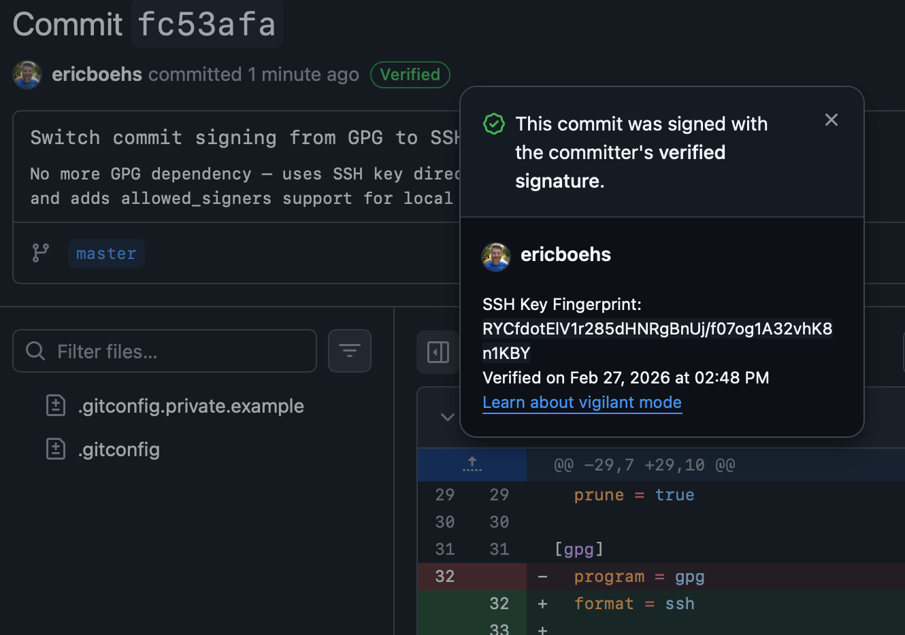

# Ditch GPG: Sign Git Commits with Your SSH Key

If you're using GPG to sign your git commits, you might be maintaining a whole extra tool and keychain just for that one purpose. Since [Git 2.34](https://github.blog/open-source/git/highlights-from-git-2-34/) and [GitHub's support for SSH signing keys](https://github.blog/changelog/2022-08-23-ssh-commit-verification-now-supported/) (August 2022), you can use your existing SSH key instead.

<!-- truncate -->

## Why switch?

GPG works, but it's one more thing to manage — key expiration, subkeys, keyservers, and the occasional `gpg --recv-keys` headache. If you already have an SSH key for pushing to GitHub, you can reuse it for signing commits too.

## Setup

### 1. Add your SSH key as a signing key on GitHub

Your key is likely already on GitHub as an **authentication** key, but signing requires adding it separately:

- Go to **Settings > SSH and GPG keys > [New SSH key](https://github.com/settings/ssh/new)**
- Set **Key type** to **Signing Key**
- Paste your public key (e.g. `~/.ssh/id_ed25519.pub`)

### 2. Configure git

```bash
git config --global gpg.format ssh
git config --global user.signingkey ~/.ssh/id_ed25519.pub
git config --global commit.gpgsign true
git config --global tag.gpgsign true
```

That's it. All your commits and tags will now be signed with your SSH key. Here's [what that looks like in a `.gitconfig`](https://github.com/ericboehs/dotfiles/commit/fc53afa66f9aca92ede4ce5c4e9d618d7acb2f5d).

### 3. Verify signatures locally (optional)

GitHub verifies signatures for you, but if you want `git log --show-signature` to work on your own machine, create an allowed signers file:

```bash
echo "your@email.com $(cat ~/.ssh/id_ed25519.pub)" >> ~/.ssh/allowed_signers
git config --global gpg.ssh.allowedSignersFile ~/.ssh/allowed_signers
```

Now `git log --show-signature` will show:

```
Good "git" signature for your@email.com with ED25519 key SHA256:...
```

Note: this is per-machine — others would need your public key in their `allowed_signers` to verify locally. This is similar to GPG, where others need your public key imported. In practice, most people just rely on GitHub's "Verified" badge.

## The result

GitHub shows the "Verified" badge on your commits, backed by your SSH key fingerprint:



No GPG daemon, no key expiration to deal with, no extra software to install. Just your SSH key doing double duty.